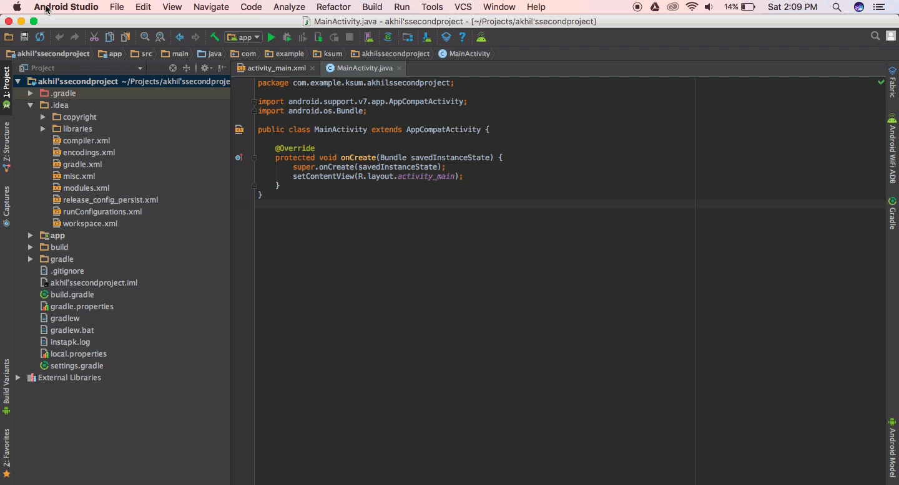
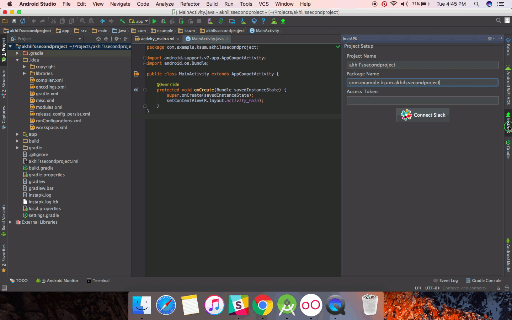
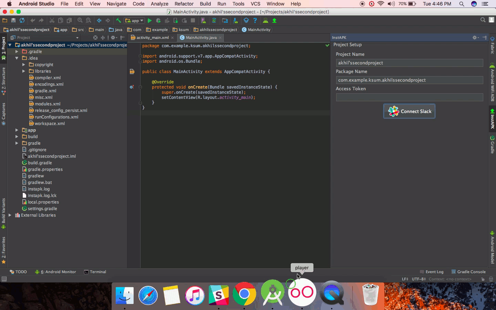

Instantly share apk files to slack channels using instapk plugin.

# How to install

You can  install `instapk` directly from Android Studio using,  

`Preferences/Settings -> Plugins -> Browse Repositories`.  

or alternatively, you can download the plugin from jetbrains site and install it manually using,  

`Preferences/Settings->Plugins->Install plugin from disk` option.  

# Usage  

After installation, we can access the setup panel as below.
 
  

- Click on the Connect to Slack.
- Login with your slack credentials, or select slack team. 
- Authorize instapk and copy the `access token`.
- Submit/Save accesstoken via plugin panel  

  

- Now you can use `upload` button on toolbar or panel to select and share apk.  

# Submit issues

We are using `github` to track any plugin related issues, so if you face any problems, submit on github issues.  

